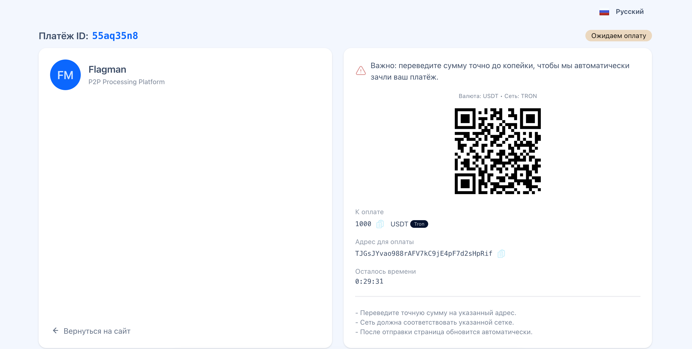
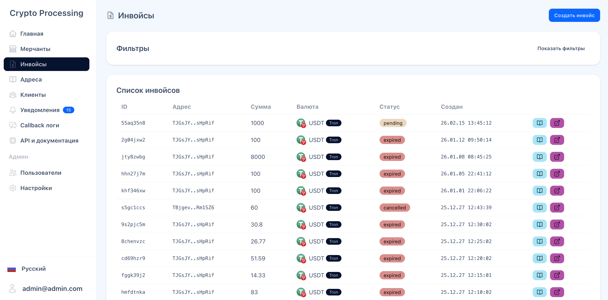

## Crypto Processing Platform
Платформа для приёма и обработки криптовалютных платежей: создание инвойсов, hosted-страница оплаты, webhook/callback-уведомления, кабинет для управления мерчантами/клиентами.

### Стек
- **Backend**: Laravel 12, PHP 8.3, InertiaJS 2, Fortify
- **Frontend**: Vue 3, Vite, Tailwind CSS, DaisyUI
- **Очереди/кэш**: Redis, Horizon
- **Доступы**: роли и permissions на базе Laratrust
- **Прочее**: генерация форм/вариантов через Wayfinder, QR-коды, интеграция Telegram Bot API

### Требования
- PHP **8.3+**
- Composer
- Node.js + npm
- База данных: MySQL 8
- Redis

