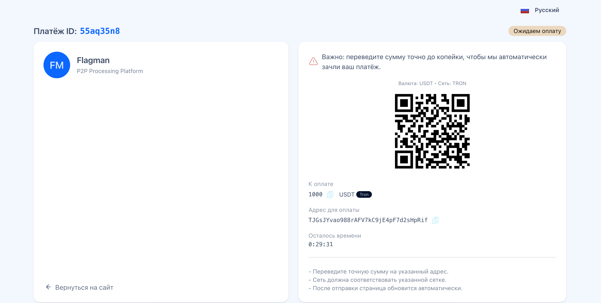
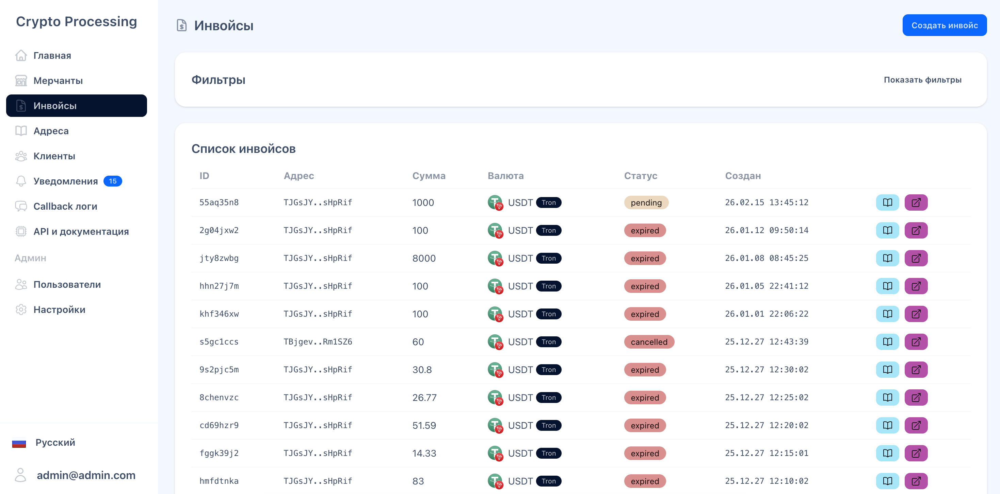

# Crypto Processing Platform

[](https://www.php.net/)
[](https://laravel.com/)
[](https://vuejs.org/)
[](https://inertiajs.com/)
[](https://tailwindcss.com/)

Платформа для приёма **USDT в сети TRON**. Позволяет создавать инвойсы, показывать покупателю отдельную страницу оплаты, отслеживать статус платежа и отправлять уведомления в сторонние системы.

## Что умеет

- создание и управление инвойсами;
- публичная hosted-страница оплаты с QR-кодом и обратным отсчётом;
- проверка входящих транзакций и статусы `pending`, `processing`, `paid`, `expired`, `cancelled`;
- REST API для создания инвойсов, клиентов и получения статусов;
- callback/webhook-уведомления о событиях инвойса;
- кабинет с мерчантами, клиентами, адресами, журналом callback-запросов и уведомлениями;
- API-ключи с ограничением по разрешённым IP;
- Telegram-уведомления;
- роли пользователей и административная панель.

> Сейчас поддерживается одна платёжная пара: **USDT / TRON**.

## Интерфейс





## Стек

| Часть | Технологии |
| --- | --- |
| Backend | PHP 8.3+, Laravel 12, Fortify |
| Frontend | Vue 3, Inertia.js 2, TypeScript, Vite |
| UI | Tailwind CSS 4, DaisyUI |
| Данные и фоновые задачи | MySQL 8, Redis, Laravel Horizon |
| Интеграции | TRON, QR-коды, Telegram Bot API |

## Требования

- PHP **8.3+** и Composer;
- Node.js и npm;
- MySQL **8+**;
- Redis.

## Быстрый старт

1. Клонируйте репозиторий и перейдите в папку проекта:

   ```bash
   git clone https://github.com/niiikkid/payment.system.git
   cd payment.system
   ```

2. Подготовьте приложение:

   ```bash
   composer run setup
   ```

   Команда устанавливает PHP- и JavaScript-зависимости, создаёт `.env`, генерирует ключ приложения, выполняет миграции и собирает frontend.

3. Настройте `.env`:

   - параметры MySQL: `DB_DATABASE`, `DB_USERNAME`, `DB_PASSWORD`;
   - параметры Redis;
   - `APP_URL`;
   - `TRONGRID_NETWORK` и `TRONGRID_API_KEY`;
   - при использовании уведомлений — `TELEGRAM_BOT_TOKEN`, `TELEGRAM_BOT_NAME`, `TELEGRAM_WEBHOOK_URL` и `TELEGRAM_WEBHOOK_SECRET`.

4. Запустите приложение, очередь, логи и Vite одной командой:

   ```bash
   composer run dev
   ```

После запуска откройте адрес, который покажет Laravel (по умолчанию `http://127.0.0.1:8000`).

## REST API

Базовый URL:

```text
{APP_URL}/api/v1
```

Все запросы API используют заголовок `X-Api-Key`. Через API можно создавать и отменять инвойсы, читать их статус, получать QR-код, а также управлять клиентами и получать список мерчантов.

Полная документация с форматами запросов и ответов: **[docs/API.md](docs/API.md)**.

## Разработка

```bash
# Тесты
composer test

# Проверка форматирования frontend-кода
npm run format:check

# Сборка production-версии frontend
npm run build
```

## Безопасность

Не добавляйте в репозиторий `.env`, API-ключи, приватные ключи кошельков или реальные токены Telegram. Для production callback-адреса принимаются только по HTTPS.
